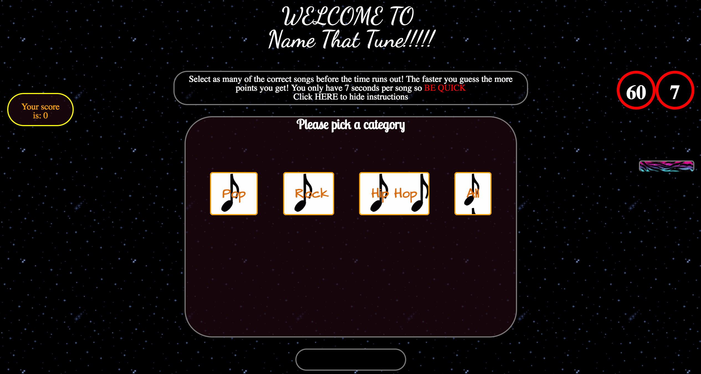
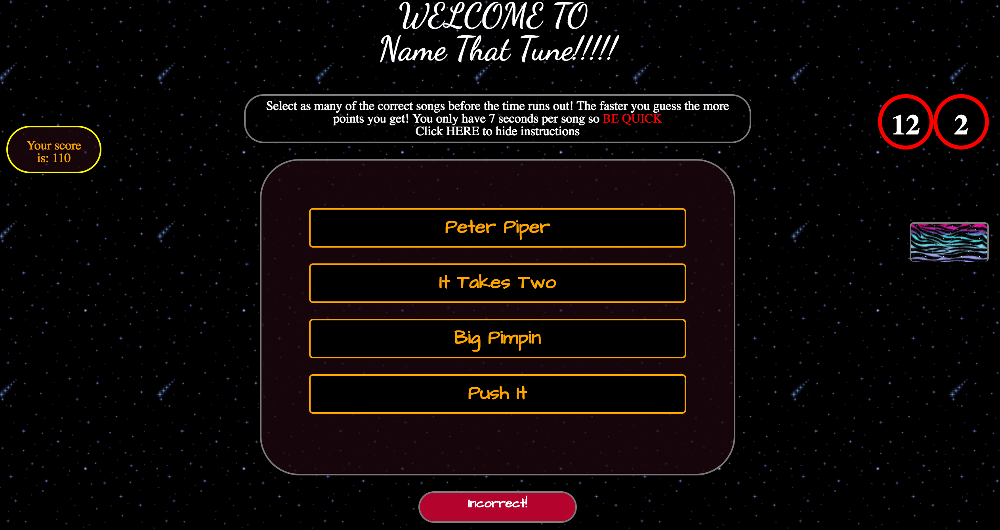
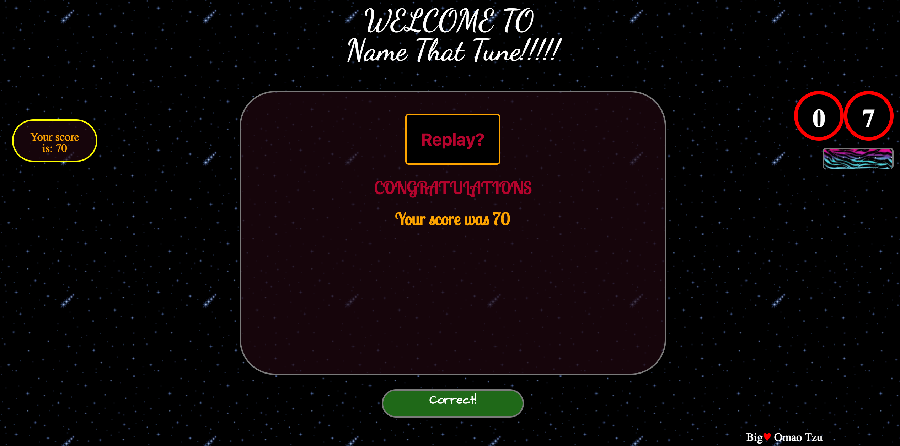

# Project-1

Name That Tune!!!

GA WDI London - Project 1

Think of the intros round from never mind the buzzcocks and you're right on the money.

Several musical categories available for selection in an all out race to see if you really do know your music or not!

[Play it here!](https://cryptic-hamlet-93856.herokuapp.com/)

Rules

After category selection you will have 60 seconds to guess as many songs within the category as possible given only a maximum of 7 seconds per song. 

Approach / How it works

Fastest to the guess is the aim of the game. Select the correct song from one of four. The faster you guess them the more points you get! You lose points for incorrect guesses.

There are sounds that are triggered upon:

A correct guess.
Every new song!
Game over.

HTML 5, CSS and jQuery were used to create this game.
Animation was created using the Animate.css stylesheet and with a tiny bit of javascript.

All sounds both cut and uploaded myself from files I own with the exception of 'Trump's Bing' which was  taken from youtube and the applause which was taken from soundbible.com.

The Google Web Font 'Architects Daughter', 'Dancing Script' & 'Lobster Two' were used to style the game as well as several gifs sourced from gify.com

Problems & Challenges

Not being very good at managing complex data type and objects in particular it took me some time to be able to both create the objects required in order to provide the multiplechoice answers coupled with the audio and the correct answers. My CSS was fiddly but I believe I got there in the end although greater responsiveness would have been ideal. My first project and definitely had a bit of post project decision regret which let me down in my ability to focus and get on with the task at hand which is a huge lesson I will learn for the future.